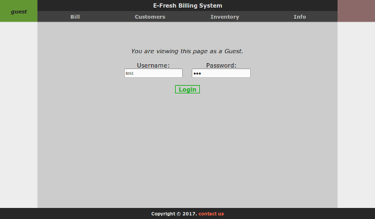

E-Billing System
================

A barebones billing system in PHP.

TODO
----

* Encrypt the password field in the login form
* Split *members* table into *members* and *stores*
* Maintain previous billing history
* Admin utility for managing members
* AJAX based tables with a "spreadsheet" style
* Switch to PostgreSQL

License
-------

Licensed under the GNU Affero General Public License. (see LICENSE.txt)
